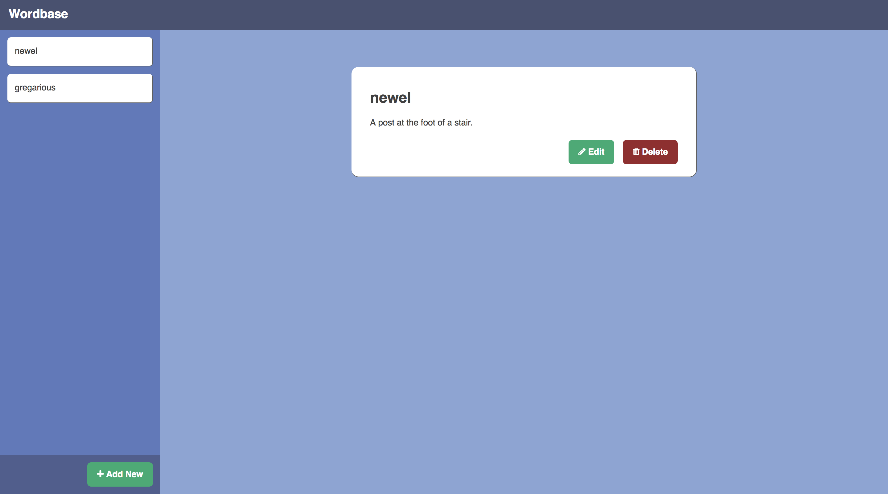

# Wordbase
Wordbase is a simple application that allows users to keep track of words they
have learned.

Using Wordbase, users should be able to:
* Create "entries" consisting of a word and definition
* Edit each entry's definition
* Delete an entry

## Backend Implementations
* [Sinatra](/backend/sinatra)
* [Flask](/backend/flask)

## Frontend Implementations
* [Angular](/frontend/angular)

